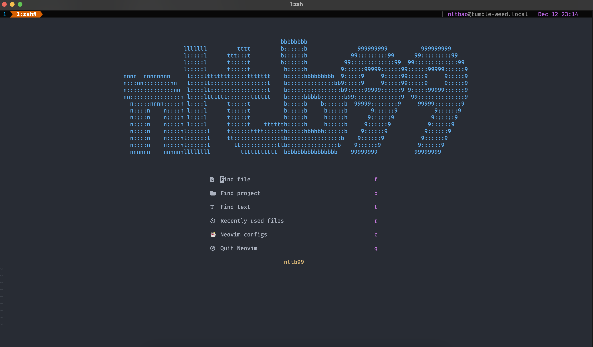
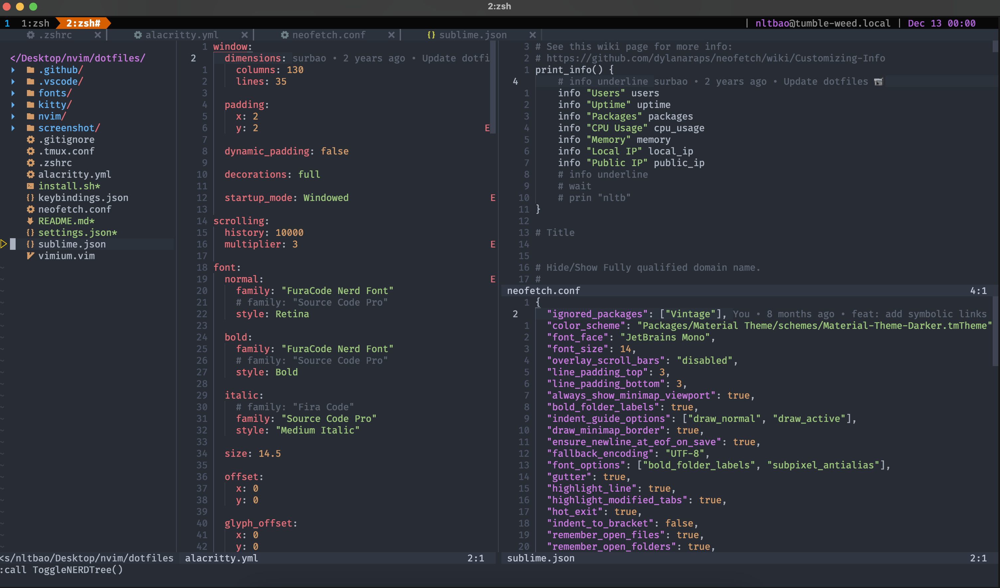
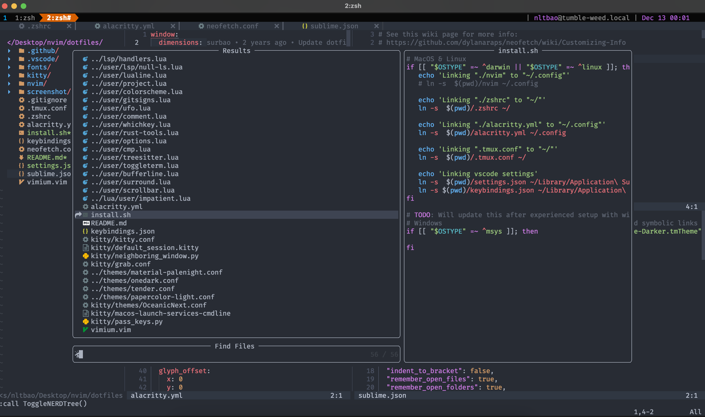

### Dotfiles

- [neovim](https://github.com/neovim/neovim)
- [zsh](https://github.com/ohmyzsh/ohmyzsh)
- [alacritty](https://github.com/alacritty/alacritty)
- [tmux](https://github.com/tmux/tmux)
- [vscode](https://github.com/microsoft/vscode)
- [raycast](https://www.raycast.com)
- [qutebrowser](https://github.com/qutebrowser/qutebrowser)
- [yabai](https://github.com/koekeishiya/yabai)
- [skhd](https://github.com/koekeishiya/skhd)
- [vimium](https://vimium.github.io)
- [neofetch](https://github.com/dylanaraps/neofetch)
- [sublime](https://www.sublimetext.com)





## Installation

```shell
./install.sh
```

### Prerequisites

- Neovim >= v0.9.x

###### macOS

```sh
# Neovim
brew install chafa gnu-sed imagemagick lazygit lua luajit prettier eslint

# Searcher
brew install ripgrep fzf the_silver_searcher

# Python
brew install black flake8 poetry pyenv python-setuptools python-packaging

# Miscellaneous
brew install cmatrix yarn tree neovim git tmux gcc gpp gh go htop n wget code-minimap

# Tmux Plugin Manager
git clone https://github.com/tmux-plugins/tpm ~/.tmux/plugins/tpm

# Enable hold the key while pressing
defaults write -g ApplePressAndHoldEnabled -bool false: Hold key press

# Disable spellcheck in notes MacBook
defaults write com.apple.notes NSAutomaticSpellingCorrectionEnabled -bool false

# Enable Show Hidden Files
defaults write com.apple.finder AppleShowAllFiles YES
```

###### Linux

> TODO: To be updated!

###### Windows

> TODO: To be updated!

## vim-plug

###### macOS

```sh
curl -fLo ~/.local/share/nvim/site/autoload/plug.vim --create-dirs \
    https://raw.githubusercontent.com/junegunn/vim-plug/master/plug.vim
```

###### Linux

```sh
curl -fLo ~/.vim/autoload/plug.vim --create-dirs \
    https://raw.githubusercontent.com/junegunn/vim-plug/master/plug.vim
```

###### Windows (PowerShell)

```powershell
iwr -useb https://raw.githubusercontent.com/junegunn/vim-plug/master/plug.vim |`
    ni "$(@($env:XDG_DATA_HOME, $env:LOCALAPPDATA)[$null -eq $env:XDG_DATA_HOME])/nvim-data/site/autoload/plug.vim" -Force
```

## Keybindings

> TODO: To be updated!

## Fonts

```py
# FuraCode Nerd Font
https://github.com/ryanoasis/nerd-fonts/releases/download/v3.1.1/FiraCode.zip

# Source Code Pro
https://fonts.google.com/specimen/Source+Code+Pro

# JetBrains Mono
https://www.jetbrains.com/lp/mono/

# Consolas
https://freefontsdownload.net/free-consolas-font-33098.htm

# References
https://www.nerdfonts.com/font-downloads
```

```js

                                               bbbbbbbb
                  lllllll         tttt         b::::::b               999999999          999999999
                  l:::::l      ttt:::t         b::::::b             99:::::::::99      99:::::::::99
                  l:::::l      t:::::t         b::::::b           99:::::::::::::99  99:::::::::::::99
                  l:::::l      t:::::t          b:::::b          9::::::99999::::::99::::::99999::::::9
nnnn  nnnnnnnn     l::::lttttttt:::::ttttttt    b:::::bbbbbbbbb  9:::::9     9:::::99:::::9     9:::::9
n:::nn::::::::nn   l::::lt:::::::::::::::::t    b::::::::::::::bb9:::::9     9:::::99:::::9     9:::::9
n::::::::::::::nn  l::::lt:::::::::::::::::t    b::::::::::::::::b9:::::99999::::::9 9:::::99999::::::9
nn:::::::::::::::n l::::ltttttt:::::::tttttt    b:::::bbbbb:::::::b99::::::::::::::9  99::::::::::::::9
  n:::::nnnn:::::n l::::l      t:::::t          b:::::b    b::::::b  99999::::::::9     99999::::::::9
  n::::n    n::::n l::::l      t:::::t          b:::::b     b:::::b       9::::::9           9::::::9
  n::::n    n::::n l::::l      t:::::t          b:::::b     b:::::b      9::::::9           9::::::9
  n::::n    n::::n l::::l      t:::::t    ttttttb:::::b     b:::::b     9::::::9           9::::::9
  n::::n    n::::nl::::::l     t::::::tttt:::::tb:::::bbbbbb::::::b    9::::::9           9::::::9
  n::::n    n::::nl::::::l     tt::::::::::::::tb::::::::::::::::b    9::::::9           9::::::9
  n::::n    n::::nl::::::l       tt:::::::::::ttb:::::::::::::::b    9::::::9           9::::::9
  nnnnnn    nnnnnnllllllll         ttttttttttt  bbbbbbbbbbbbbbbb    99999999           99999999
```
